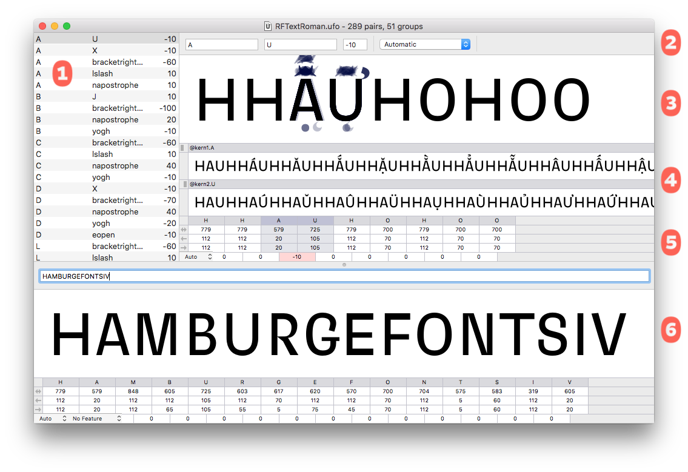
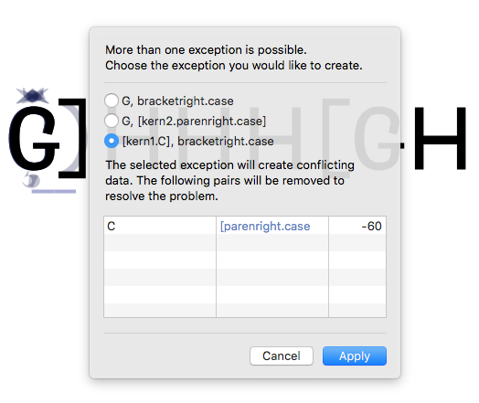

###### [Home](index.html)

---

## Editing Kerning

Most of the time in MetricsMachine will be spent in the main window. Interactive manipulation of kerning data is done here.

### 1 Pair List
This shows the pairs in the loaded list. When you first open a font, this list will be populated with all kerning pairs in the font.

### 2 Editing Controls
These controls manage the editing view. The text entry controls on the left represent left member of a pair, right member of a pair and the pair value. The popup in the middle controls the context definition that will be used to preview the pairs. If Automatic is selected, the application will find the first rule that matches the pair to be displayed. You can also choose a particular context definition and overrule the rule evaluation. The timeline on the right shows you how far you have progressed through the current pair list.

### 3 Editing View
This is the main view for editing pairs. A blue rectangle highlights the current pair within the view. You can optionally view pairs in a way that shows all members of the current group. This is called the Group Stack:

The editing view has a number of keyboard shortcuts that simplify the way you interact with the view:

Navigation | |
---|---
↓ | Next pair in the pair list.
↑ | Previous pair in the pair list.
⇧+↓ | Next member of the group the left member of the pair belongs to.
⇧+↑ | Previous member of the group the left member of the pair belongs to. 
⌥+↓ | Next member of the group the right member of the pair belongs to.
⌥+↑ | Previous member of the group the right member of the pair belongs to.
⌘+F | Flip the current pair.

Editing | |
---|---
← | -10 from the current pair value. 
→ | +10 to the current pair value.
⇧+← | -5 from the current pair value.
⇧+→ |  +5 to the current pair value.
⌥+← | -1 from the current pair value.
⌥+→ | +1 to the current pair value.

##### Exceptions

When you want to create an exception, the application will look at the possible exception types for the pair. If more than one type of exception is possible, you will be presented with an exception popup.

If you already have an exception for the pair, the application will catch this and alert you to the conflict.

### 4 Group Preview
This optional preview shows you the left member of the current pair plus all members of the right member of the pair’s group and vice-versa.

### 5 Glyph Data
This shows metrics data about each glyph in the edit view.

### 6 Typing Pane
This pane allows you to type arbitrary text for reference while kerning. This pane can automatically add suffixes to the glyph names of the string being previewed. For example, if you have typed `HAMBURGEFONTS` and you select small from the popup button in the lower left corner, the view will display the equivalent of `/H.small/A.small/ M.small/B.small/U.small/R.small/G.small/E.small/F.small/O.small/N.small/T.small/S.small`.

---

###### [Next: Conflict Resolution](conflict_resolution.html)