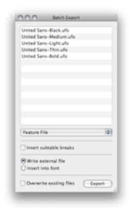

###### [Home](index.html)

---

## Exporting Kerning

MetricsMachine exports kerning in two formats: as an AFDKO ready kern feature or as an AFM file. When exporting a feature file, you can export to an external file or add the kern feature to the features inside of the UFO. Yo can also instruct the application to insert subtable breaks if you need them. This should only be done only if a feature file without the breaks is causing an overflow when your OpenType font is compiled.

### Batch Export

A batch exporter is available under the File menu. To use it, drag UFOs from the Finder to the list, select the output format and press the Export button. If you choose to write the kern feature into the font, the feature will be added to the features in the UFO. If you choose to write an external file, the files will be saved next to the UFOs using a unique file name. If Overwrite existing files is checked, existing feature files or AFM files will be overwritten.

---

###### [Next: Pair Lists](pair_lists.html)