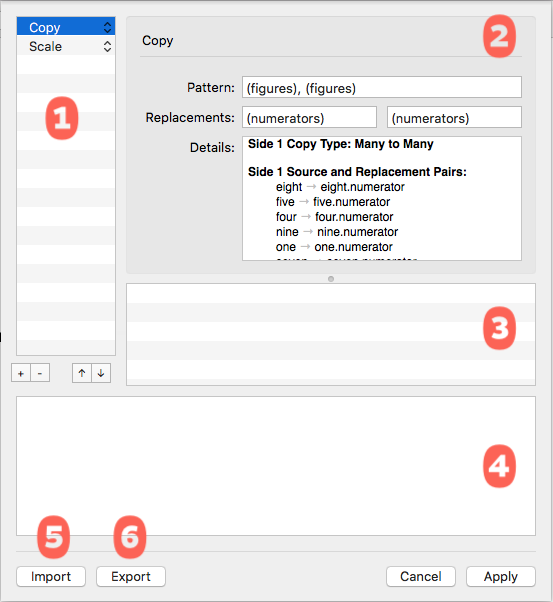
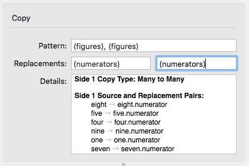
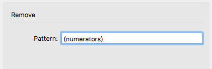
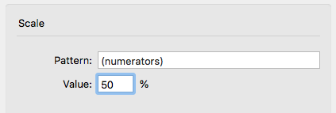
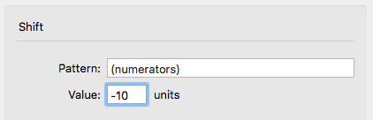
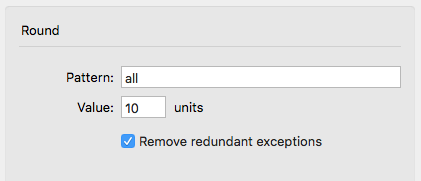
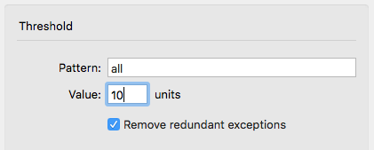

###### [Home](index.html)

---

## Transformations

MetricsMachine allows you to perform powerful transformations on your kerning data. These are created and applied in the Transformations sheet.

### 1 Transformation List
In this list you build a chain of transformations that you would like to perform. It is important to understand that each transformation builds on the result of the previous transformations. The transformation types are detailed below.

### 2 Transformation Settings
The settings for the currently selected transformation. In all transformation types, the pair and glyph entry fields use the [search syntax](search_syntax.html).

### 3 Modified Pair List
All pairs that will be modified by the currently selected transformation. The displayed values are the values that will be in place after the transformation is complete.

### 4 Preview
A preview of the pair selected in the modified pair list.

### 5 Import Transformations
You can import the transformations from a MetricsMachine Transformations file. 

### 6 Export Transformations
You can export the transformations to a MetricsMachine Transformations file.

### Transformation Types

### **copy**

This transformation type allows you to copy kerning pairs that match a particular pattern and insert replacements into the pairs. The *Pattern* defines the pairs that you want to copy. The *Replacement* fields, one for the left side of pairs and another for the right side of pairs, specify what should be inserted into the pairs. You can specify only a left or right replacement, or you can specify both left and right replacements at the same time. The specifics of what will be copied and where it will go, along with important warnings and errors, will be shown in the *Details* section. Pay careful attention to this report.

There are four copy types that can happen depending on the number of pairs found for *Pattern* and the number of glyphs/groups found for *Replacement*.
	
#### **One To One**

For example, `A → A.sc` will copy the values of all pairs containing A to A.sc. You must explicitly define groups in the Pattern or Replacement if you want to use a group.

#### **One to Many** 

For example, `A → A.sc` or `{A*.sc}` or Aacute.sc or `{Aacute.sc}` will copy the values of all pairs containing `A` to `A.sc`, `Aacute.sc` , the group containing `A.sc` and the group containing Aacute.sc. You must explicitly define groups in the Pattern or Replacement if you want to use a group.

#### **Many to One** 

For example, `A` or `{A} → A.sc` will copy the values of all pairs containing `A` to `A.sc`. You must explicitly define groups in the Pattern or Replacement if you want to use a group.

#### **Many to Many** 

For example, `(uppercase) → (smallcaps)` will copy the values of all pairs containing a glyph in the reference group uppercase to a corresponding glyph in the reference group smallcaps. This will also try to automatically match as many groups as possible for any glyphs defined in Pattern and Replacement. The Details section should always be reviewed when making a Many to Many copy.
	
### **Remove**	
	

This transformation removes all pairs found for *Pattern*.

### **Scale**

This transformation scales all pairs found for Pattern by *Value*.

 
### **Shift**

This transformation adds *Value* to all pairs found for *Pattern*.
	
### **Round**
 	

This transformation rounds all pairs found for Pattern to increments defined by Value. Remove redundant exceptions will eliminate all exceptions that match the pair that they are excepting.

### **Threshold**

This transformation removes all pairs found for Pattern that have a value greater than negative Value and less than positive Value. Remove redundant exceptions will eliminate all exceptions that match the pair that they are excepting.

---

###### [Next: Reference Groups](reference_groups.html)