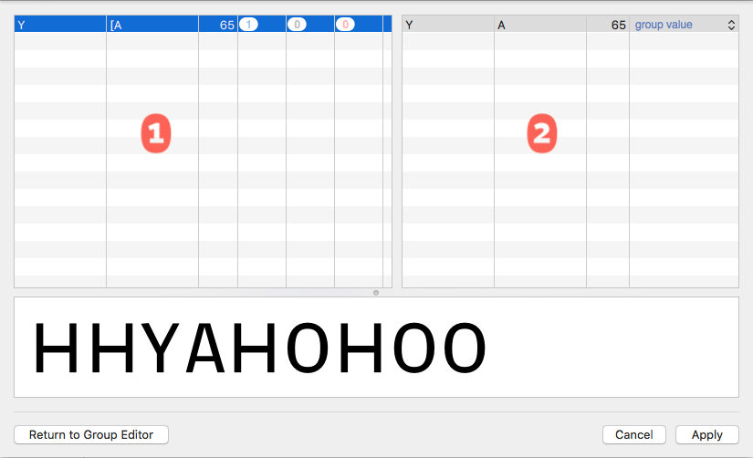

###### [Home](index.html)

---

## Conflict Resolution
 
While editing groups, you could create conflicting kerning data if your font already has kerning pairs. If this has happened, MetricsMachine will present the Conflict Resolution sheet. This sheet shows all of the conflicting pairs along with detailed information about how the conflicts will be resolved. The application does its best to work out how the conflicts should be resolved, but you should always review the resolutions to make sure that the correct decisions have been made.

### 1 Conflict List
This list shows all of the grouped pairs that have conflicting values. The list shows the members of the pairs, the pair values and the resolution type counts. Select one item in the list to see detailed information.

### 2 Resolution List
This list shows, from side1 to side2, the side1 and side2 pair members, pair value and resolution type for all conflicting pairs within the higher-level group pair. As mentioned above, MetricsMachine attempts to determine how you will probably want to resolve the conflicts. If you want to override the deduced resolutions, select from the options in the popup in the resolution type column. The options are:

Resulution list | |
---|---
group value | The value that should be used as the value for the higher-level pair.
exception | This pair should become an exception to the higher-level pair.
follow group | This pair should take on the higher-level pair value.

---

###### [Next: Spreadsheet](spreadsheet.html)