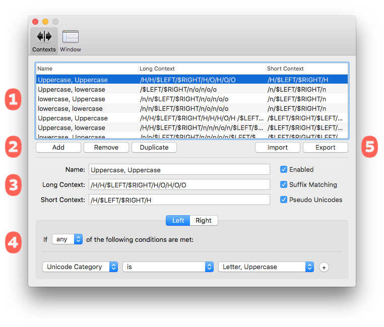

###### [Home](index.html)

---

## Context Definitions

One of the most difficult parts of kerning is preparing contexts in which to view all of the pairs. MetricsMachine gives you a powerful way to create contexts for pairs on the fly. These *context definitions* will be evaluated whenever you want to view a pair. For example, you can define a context for pairs of the type `figures`, `figures` and when you look at `three`, `four` your context definition will be matched and used to display the preview. These context definitions are created and managed in MetricsMachine’s Preferences window.

### 1 Context Definitions List
This list shows all the definitions that the application will evaluate for each pair and the order in which they will be evaluated. If you want to reorder definitions, simply drag and drop within the list.

### 2 Add, Remove, Duplicate
Add, remove and duplicate context definitions.

### 3 Context Definition Settings

#### Name
	
A unique name for the context definition.

#### Long Context

This defines the long preview string for the context definition. This will be used throughout the interface to preview pairs. This should be a / separated list of glyph names. There are six special keywords that can be used to dynamically update the preview strings:

keyword | |
---|---
$LEFT | The left member of a kerning pair.
$RIGHT | The right member of the kerning pair.
$LEFTCLOSE | The closed partner for the left member of the pair. For example if ( is the left member of the pair, the left closed partner will be ).
$LEFTOPEN | The open partner for the left member of the pair. For example if ) is the left member of the pair, the left open partner will be (.
$RIGHTCLOSE | The closed partner for the right member of the pair. For example if ( is the right member of the pair, the right closed partner will be ).
$RIGHTOPEN | The open partner for the right member of the pair. For example if ) is the right member of the pair, the right open partner will be (.

For example, if your long context is `/H/H/$LEFT/$RIGHT/H/H` and the pair to be viewed is `A`, `B` the string that will be used for the preview is `/H/H/A/B/H/H`.

#### Short Context

This defines the short preview string for the context definition. This will be used in the group preview in the main editor. The special keywords defined for the long context can also be used in the short context.

#### Enabled
Check to enable the context definition for matching.

#### Suffix Matching

If checked, when a context is matched, the application will take the suffix from the members of the pair and try to apply it to members of the preview string. If glyph names are matched, these glyph names will be used for the preview string. For example, if your long context for figures is `/one/one/$LEFT/$RIGHT/one/zero/one/zero/` `zero` and the pair being viewed is `three.lining`, `four.lining`, the application will take
the .lining suffix from the pair and try to apply it to the glyph names in the context. In this case, the string that the application will try to match is `/one.lining/one.lining/` `three.lining/four.lining/one.lining/zero.lining/one.lining/zero.lining/zero.lining`.

#### Pseudo Unicodes

When checked the application will attempt to create a pseudo-Unicode value for any glyphs that do not have a defined Unicode value. This allows glyphs such as A.alt to be handled using the same rules as A.

### 4 Pair Matching Rules

Within each context definition you create one or more matching criteria for each side of a kerning pair. These are the criteria that will be used to evaluate a match for each pair. The glyph data that can be matched are:

Anything | Matches all glyphs.
---|---
Name | The glyph’s name.
Unicode Value | The glyph’s Unicode value.
Unicode Category | The category of the glyph’s Unicode value.
Unicode Script | The script that the glyph’s Unicode value is in.
Unicode Block | The block that the glyph’s Unicode value is in.

### 5 Import and Export

You can import and export your context definitions into an external file.

---

###### [Next: Importing Kerning](importing_kerning.html)