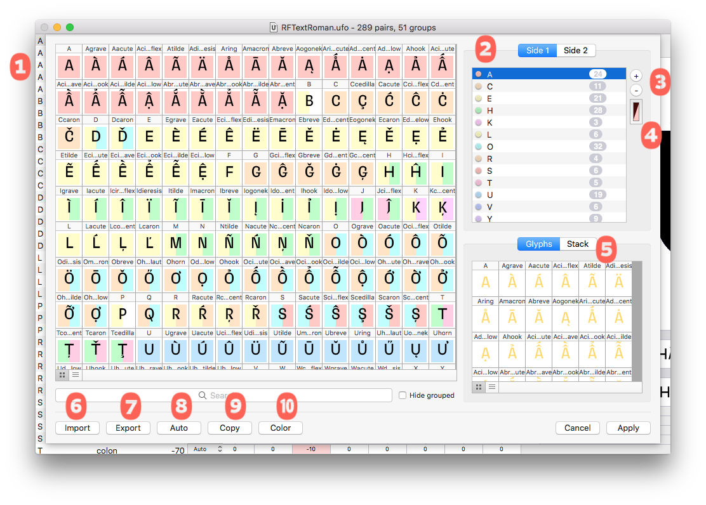
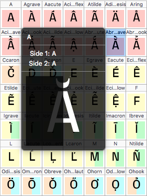
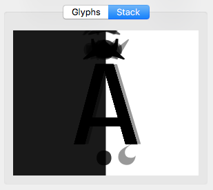
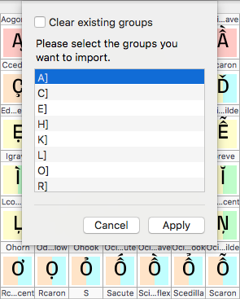
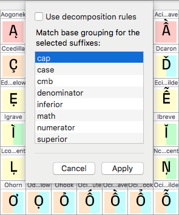
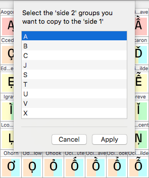

###### [Home](index.html)

---

## Editing Groups

All group editing is done in the Group Editor. This editor shows you all glyphs and allows you to add the glyphs to left and right groups. When you are finished editing, the application will adjust your kerning data based on the new groups.

### 1 Source Glyphs
All glyphs in the font. The glyphs are displayed with a color on the side1 and/or side2 indicating which group the glyph belongs to. To see a stacked preview of the currently selected glyphs hold the control key.

To add glyphs to a group, select the glyphs and drag them to the group in the group list or to the group preview.

### 2 Source Display Options
The search field allows you to narrow down the glyphs on display using the search syntax. Hide grouped will hide glyphs grouped on the currently selected side.

### 3 Group Lists
These lists show the left and right groups. The counter shows how many glyphs are in each group.

### 4 Add and Remove
The add and remove group buttons add and remove groups to or from the current group list. If you have the `⌥` key down when the add group button is pressed, the selected glyphs will be automatically added to the new group. If you have the ⌘ key down when the add group button is pressed, the name of the first glyph in the current selection will be used as the name of the new group.
When naming groups, the names must adhere to the AFDKO syntax class name specification. The group editor will let you know if you have made an invalid group name. In some cases, MetricsMachine analyzes the group name to determine which member glyph should be used to display the group. Because of this, it is recommended that you name groups with the name of a glyph that you consider to be a good representative of the group.

### 5 Group Color
To change the color used to indicate a group in the glyph cells, select the group, press the color button and select a new color.

### 6 Group Preview
This shows all members of the currently selected group. There are two display modes Glyphs as shown above and Stack which shows all glyphs in the group stacked on top of each other.

To remove glyphs from a group, select the glyphs on display in Glyphs mode and press the delete key.

### 7 Import Groups
You can import groups from three possible sources: a MetricsMachine Groups file, another UFO or from a feature file containing a class kerning feature. Once you have selected a source file, the groups will be extracted and you will be presented with some importing options.

The list shows all groups that were found in the source file. The brackets show the side the groups belong to following the search syntax conventions. If you select Clear existing groups all existing groups will be removed.

### 8 Export Groups
You can export the groups to a MetricsMachine Groups file.

### 9 Auto Groups
MetricsMachine can automatically create some groups for you.

There are two ways that it can do this: *Use decomposition rules will* try to deduce the base glyph of an accented glyph by referencing Unicode values and the Unicode decomposition rules. For example, `Aacute` will be grouped with A. The other option will try to group glyphs with suffixes in their names following the group structure of the base glyphs. For example, if `zero` is in a group called `MyZero` and you have `zero.sc`, `zero.sc` will move to a group called `MyZero.sc`.

The results of auto-grouping should always be carefully checked.
 
### 10 Copy Groups
You can copy left groups to the right or vice-versa.

### 11 Color Groups
This will apply automatic coloring to all groups.

---

###### [Next: Editing Kerning](editing_kerning.html)