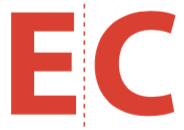

###### [Home](index.html)

---

## Overview

No one likes kerning. MetricsMachine tries to help out by giving you a streamlined environment for getting your kerning over with as quickly as possible. There are several key things that you should understand before using the application.

### Groups

In MetricsMachine you define kerning groups to link similarly shaped glyphs. Groups are defined for two sides `side1` and `side2`. These sides correspond to a glyph’s position within a kerning pair.

For example, a `side2` group could consist of these glyphs:

And a `side1` group could consist of these glyphs:

Be careful to not get too carried away with how deep you make your groups. OpenType has some table size limitations that can be triggered if you make your groups overly complex. Keep it logical and you should be alright.

### Pair Types

MetricsMachine supports four kerning pair types:

pair types |    |
---|---
glyph, glyph | The left and right members are both glyphs. 
glyph, group | The left member is a glyph and the right member is a group.
group, glyph | The left member is a group and the right member is a glyph.
group, group | The left and right members are both groups.

The group, group pair type is the highest-level pair possible. All of the other pair types can be used as exceptions to a higher-level pair. Exceptions allow you to have a value for all members of groups in 
a pair with special cases for specific members.

### Workflow

MetricsMachine was designed with a specific workflow model in mind.

1. **Create context definitions.**
	These will help you tremendously when kerning. You can do this stage once and reuse
	the definitions in many families.	
2. **Finish the design of your typeface.**
	Kerning is not fun and it is even less fun if you have to go back into the kerning because you changed serif structures.
3. **Build your groups.**
	Take your time. These are important.
4. **Create pair lists.**
	These will keep you on track during the kerning process.
5. **Kern.**
	There is no avoiding this. Sorry.
6. **Export the kern feature.**
	Export your kerning as a feature file and move on to more exciting things.
	
---

###### [Next: Editing Groups](editing_groups.html)