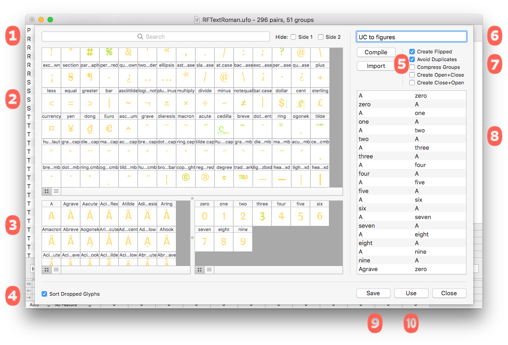

###### [Home](index.html)

---

## Pair Lists

The pair lists used to display pairs in the main window can have two formats: Pairs or Words. Pairs format specifies two glyph names and MetricsMachine will use your context defintions to display the pairs. Words format specifies both the pair and the context used for display.

### Pairs Format

The first line of the file must start with `#KPL:P`: followed by a title for the list. Pairs are specified as two glyph names separated by a space. You can add comments by starting a line with `#`.

```
#KPL:P: LC Pairs
a a
a b
a c
a d
o question
```

### Words Format

The first line of the file must start with #KPL:W: followed by a title for the list. Pairs are specified as two groups of characters or glyph names separated by a space. The pair consists of the last character of the first group and the first character of the second group. If you want to specify glyph names, the glyph names must be separated by a /. You can add comments by starting a line with `#`.

```
#KPL:W: All Words
baza ar
ha bits
ba ck
ha drian
/h/e/l/l/o /question
```

### Pair List Builder

Building pair lists by hand in a text editor is not fun. To make this process easier, MetricsMachine has a drag and drop interface for creating pair lists.



### 1 Source Display Options
The search field allows you to narrow down the glyphs on display using the search syntax. The checkboxes will allow you to hide glyphs in the left or right side lists.

### 2 Source Glyphs
All glyphs in the font.

### 3 Side Lists
The list on the left contains the glyphs that you want to be on the left side of pairs and the list on the right contains the glyphs that you want to be on the right side of pairs. To add glyphs to one of these lists, select glyphs in the source list and drag to the desired list. To remove glyphs, select the glyphs and press the delete key.

### 4 Sort Dropped Glyphs
If checked, this will sort the glyphs in the side list following a preset order. Otherwise, the glyphs will be stored in the order you dropped them into the list.

### 5 Compile and Import

#### Compile
This will iterate over the left side glyphs and the right side glyphs and create pairs. For example, if your left list contains A and B and your right list contains C and D, four pairs will be compiled: A+C, A+D, B+C and B+D.

##### Import
This will allow you to import pairs from an existing pair list.

### 6 Pair List Title

### 7 Compilation Options

#### Create Flipped
When checked, this will create flipped versions of the pairs created by the compile operation. For example, if your left list contains A and B and your right list contains C and D, four pairs will be compiled: `A+C,` `C+A`, `A+D`, `D+A`, `B+C`, `C+B`, `B+D` and `D+B`.

#### Avoid Duplicates
When checked, any pairs generated by the compile operation that are already in the pair list will not be added to the pair list.

#### Compress Groups
When checked, this will scan the glyphs in a side list, make note of the glyphs that are in the same group and only use one of the group members to compile pairs.

#### Create Open+Closed
When checked, this will create open, right and right, closed pairs based on your left and right glyphs. For example, given parenleft in your left list and A in your right list, this will generate the pairs: parenleft, A and A, parenright.

#### Create Closed+Open
When checked, this will create closed, right and right, open pairs based on your left and right glyphs. For example, given quoteright in your left list and A in your right list, this will generate the pairs: quoteright, A and quoteleft, A.

### 8 Pairs List
### 9 Save Pair List
### 10 Use Pair List
Occasionally you don’t need to save a pair list. This button will send the pairs in the list directly to the kerning editor for immediate use.

---

###### [Next: Search Syntax](search_syntax.html)