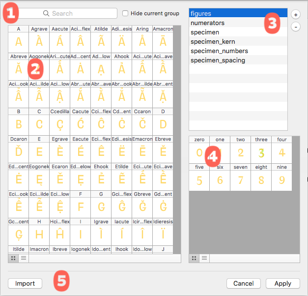

###### [Home](index.html)

---

## Reference Groups

It is often useful to have font specific categories or groups of glyphs for reference. These groups can be used in when searching for glyphs, performing transformations or building pair lists. In MetricsMachine these groups are called *reference* groups.

### 1 Source Display Options
The search field allows you to narrow down the glyphs on display using the search syntax. Hide current group hide glyphs in the current group.

### 2 Source Glyphs
To add glyphs to a group, select the glyphs and drag them to the group in the group list or to the group preview.

### 3 Group List

### 4 Group Contents

### 5 Import Groups
You can import reference groups from another UFO.

---

###### [Next: Context Definitions](context_definitions.html)