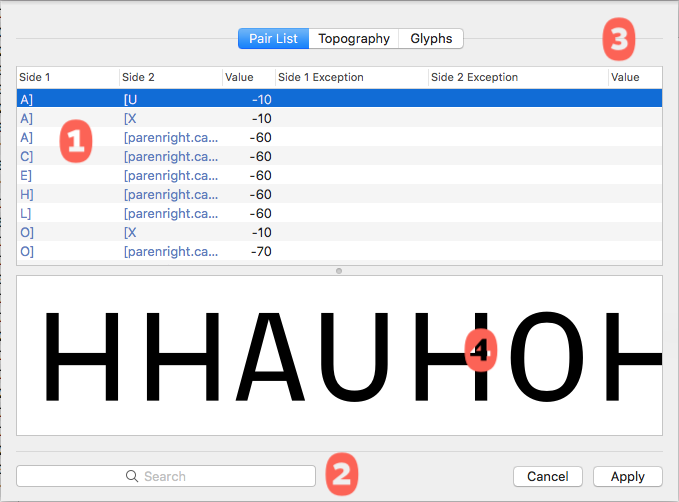
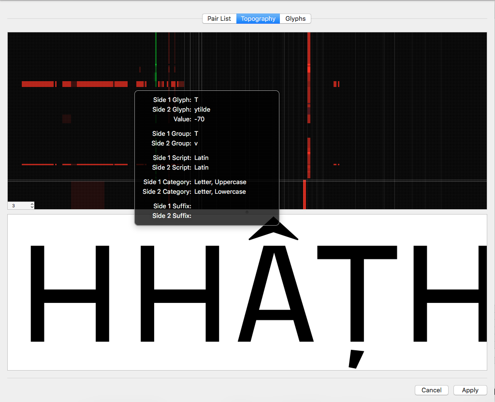

###### [Home](index.html)

---

## Spreadsheet

MetricsMachines’s Spreadsheet sheet shows you all of your kerning pairs as flat data.

### 1 Pair List
This list shows all kerning pairs in the font. The columns tell you the right and left members of the pair, the value of the pair and, if the pair is an exception, what the pair is excepting. The value column may be edited by double clicking the cell you wish to edit. If you want to delete one or more pairs, select the pairs and press the delete key.

### 2 Search Field
The search field allows you to narrow down the pairs in the list using the search syntax. 3 Display Mode
The Spreadsheet sheet allows you to view your kerning data in two different ways: a simple list of all pairs and as a kerning topography.

### 4 Preview
A preview of the selected pair.

### Kerning Topography

When viewing the kerning data in Topography mode, your pair data is presented as a grid of colored cells showing all possible kerning pairs in the font.

If a cell is black, the pair has an implicit zero value, meaning that there is no defined value for the pair. If the cell is red, the pair has a negative value. If the cell is yellow, the pair has a defined zero value. If the cell is green, the pair has a positive value. If a blue square appears in the middle of a cell, the pair is an exception. The positive and negative colors increase in intensity to indicate larger values. The pairs are grouped into subsections based on Unicode values and glyph name suffixes.

As you move the cursor over the view, a popup will give you data about the pair the cursor is currently over.

---

###### [Next: Transformations](transformations.html)